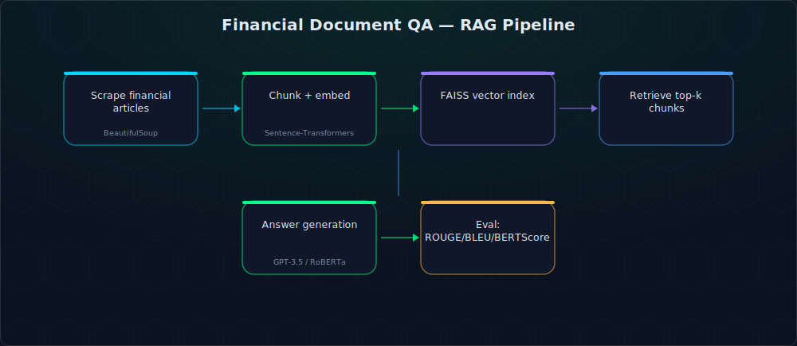

# Domain-Specific LLM Question Answering on Financial Data

A retrieval-augmented question-answering system over financial news and filings — built and benchmarked across three model choices (OpenAI GPT-3.5, a fine-tuned RoBERTa-large-SQuAD2, and a base Hugging Face QA pipeline) to compare retrieval quality and answer accuracy on finance-specific questions.

> **Team project**, originally developed as *FinancialDataUsingLLM*. See [Contributors](#contributors) below for who built what.

## What it does

Financial Q&A is a good stress test for RAG: terminology is domain-specific, source documents are long, and a wrong answer is worse than no answer. This project scrapes and chunks financial articles, embeds them with Sentence-Transformers, indexes them in **FAISS** for similarity search, then compares three ways of generating the final answer from the retrieved context — and scores all three with ROUGE, BLEU, and BERTScore against reference answers.



## Key features

- **Scraping pipeline** for financial articles (Moneycontrol), cleaned and chunked with LangChain's recursive text splitter
- **FAISS vector index** over Sentence-Transformer embeddings for fast semantic retrieval
- **Three interchangeable answer generators**: OpenAI GPT-3.5, a fine-tuned `deepset/roberta-large-squad2`, and the stock Hugging Face QA pipeline — selectable per query
- **Quantitative evaluation harness** comparing model outputs against reference answers using ROUGE, BLEU, and BERTScore
- **Streamlit UI** for asking questions and visualizing evaluation metrics

## Tech stack

`Python` · `LangChain` · `FAISS` · `Sentence-Transformers` · `Hugging Face Transformers (RoBERTa)` · `OpenAI API` · `BeautifulSoup` · `Streamlit` · `Weights & Biases` (fine-tuning tracking)

## Repository structure

```
QuestionAndAnswerUsingLangchainInFinance/
├── extract_urls.py          # Scrapes source article URLs
├── load_documents.py        # Loads/chunks scraped documents
├── FAISS_INDEX.py           # Builds and persists the FAISS index
├── QnA.py                   # Core QA logic — all 3 model paths
├── finetuning.ipynb         # RoBERTa fine-tuning notebook
├── evaluation.py            # Generates predictions for scoring
├── metrics_evaluation.py    # ROUGE / BLEU / BERTScore computation
├── main.py                  # Streamlit app
└── requirements.txt
```

## Setup

```bash
git clone https://github.com/ananthakrishna4747/Domain-Specific-LLM-Finetuning-on-Finance-Dataset-.git
cd Domain-Specific-LLM-Finetuning-on-Finance-Dataset-/QuestionAndAnswerUsingLangchainInFinance
pip install -r requirements.txt
```

Create a `.env` file:
```
open_api_key=YOUR_OPENAI_API_KEY_HERE
WANDB_API_KEY=YOUR_WANDB_API_KEY_HERE   # only needed for fine-tuning
```

Run the app:
```bash
streamlit run main.py
```

## Contributors

- **Manoj Kumar** ([@ManojKumarKolli](https://github.com/ManojKumarKolli)) — led OpenAI model integration and fine-tuning, built the evaluation metrics
- **Meghana Reddy** ([@DasireddyMeghana](https://github.com/DasireddyMeghana)) — data scraping/preprocessing and the FAISS indexing system
- **Anantha Krishna Chilappagari** ([@ananthakrishna4747](https://github.com/ananthakrishna4747)) — built the Streamlit application, integrated the Hugging Face model, implemented metric plotting and human-centric evaluation

## License

No license file is currently included in this repository — treat as personal/educational project code.
